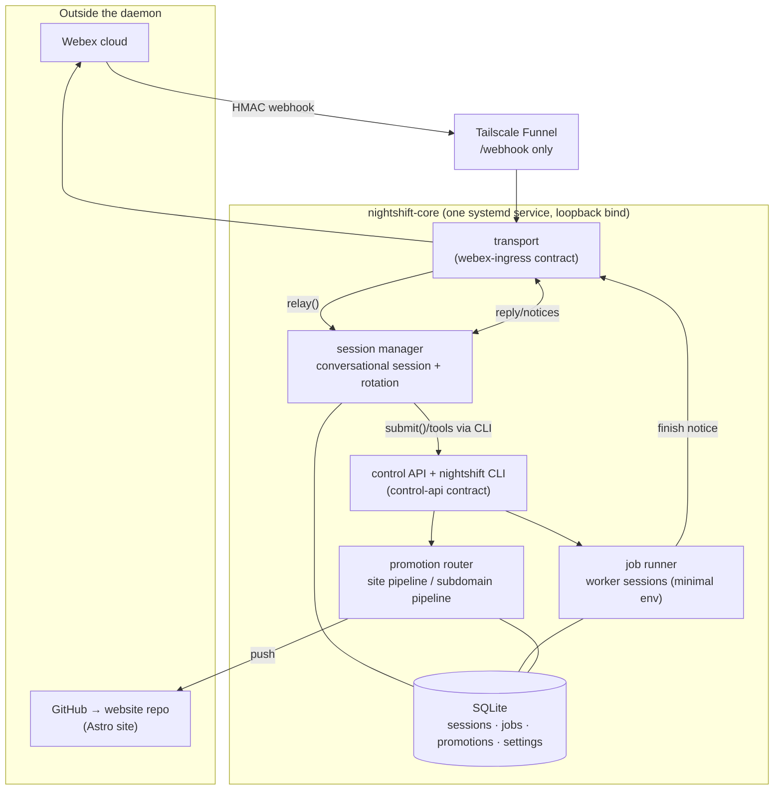

# Nightshift Assistant — Codebase Orientation Report

## 1. In one paragraph

Nightshift Assistant is a personal software robot that lives inside a single Webex chat. Its owner sends it messages the same way they'd text a person, and it can hold a conversation, kick off long-running jobs in the background (building small apps, writing stories, researching a topic, producing technical guides), tell the owner when those jobs finish, and publish finished content to the owner's own websites — all without any other app, dashboard, or command list. It runs as one program (a "daemon") on the owner's home server, replacing an earlier, more tangled system (called NSAF) that had grown fragile. It is built and evolved by a structured AI-driven development process (the Verity framework), one small, reviewed unit of work at a time.

## 2. The problem it solves

The project's own founding document, `docs/assistant-keep-kill.md`, states plainly that the prior system's "defining structural failure was fragmentation: a Python Flask app + Webex bot, a Node orchestrator, and an idea-generator all writing to one SQLite database through hand-copied schemas (six copies), with two competing promotion paths and no shared state-transition rules." That document — the project's vision input — records a decision made on 2026-07-06: retire that system's core rather than repair it, and rebuild as "a single-user personal assistant, accessible via Webex, that does everything NSAF does — plus general assistant duties."

The same document names the specific behavioral requirement driving the architecture: "long-running work never lives in the conversational session" — because a chat thread that also tries to run an hours-long build is fragile, unresponsive, and hard to reason about. It also names five "security carryovers" from the old system's incident history (webhook signature verification, a default-deny environment for background workers, a minimal public network surface, a pre-push secret scan, and never combining debug mode with a public bind) as hard requirements, not aspirations, on the new build.

> **What this means:** The previous version of this system broke because it had grown by accretion — several programs sharing one database with no agreed rules about who could change what, and no single record of what state a database row is really in. The new project's core bet is that keeping everything in one program, with one database, and strict rules about what can transition into what, prevents that kind of drift from recurring.

## 3. How it works

The system is one Node.js/TypeScript daemon (ADR 0001, ADR 0002) running under systemd on the owner's development server (ADR 0003), reachable from the internet only through a Tailscale Funnel tunnel that exposes exactly one route, `/webhook` (ADR 0006). All state lives in a single SQLite file with a numbered migration ladder (`migrations/0001`–`0006`, ADR 0004). The daemon's own wiring is in `src/app.ts`, which constructs and connects five parts:

- **Transport** (`src/transport/`) — verifies inbound Webex webhook deliveries (HMAC signature, fetched-sender identity, message-id dedup — `contracts/webex-ingress.md`), and sends replies back, chunked and optionally with file attachments.
- **Session manager** (`src/session/`) — owns the one conversational Claude Code session: relaying each message to it (`relay()`), and rotating it daily or at a size cap, writing a day summary and promoting durable facts to memory before seeding the next session (`contracts/assistant-session.md`).
- **Job runner** (`src/jobs/`) — spawns background worker Claude sessions for anything long-running (app builds, stories, studies, technical guides), with a default-deny environment (workers never see the Webex bot token or infrastructure credentials), persisted state, PID reconciliation across daemon restarts, and bounded retries (`contracts/job-lifecycle.md`).
- **Control surface** (`src/transport/api.ts` + `bin/nightshift`) — a loopback-only `/api/v1/` HTTP API and a matching `nightshift` CLI, which is the *only* way the conversational session is allowed to act on jobs, rotation, or promotion (`contracts/control-api.md`).
- **Promotion** (`src/promotion/`) — daemon-resident, deterministic (not AI-driven) code that publishes finished content to the owner's public sites via GitHub, with a dry-run/confirm gate and a pre-push secret scan (ADR 0008). A router (`src/promotion/route.ts`) inspects the shape of the content directory to decide the pipeline: technical-guide output and study-guide output both route to the Astro website pipeline (`contracts/site-promotion.md`); story output is explicitly rejected as "not yet designed"; anything unrecognized is rejected. A second pipeline for subdomain-per-app promotion (`contracts/promotion.md`) exists in code but no content shape currently reaches it.

> **What this means:** Think of the daemon as a small office with one phone line (the Webex webhook) and one filing cabinet (the SQLite database). A receptionist (transport) answers the phone and checks caller ID before passing anything through. One conversation partner (the session manager) handles the actual back-and-forth. When that partner needs something done that would take too long to do while on the phone, it hands a work order to a back office (the job runner), which does the work with none of the front office's keys or passwords, then reports back. A separate, rule-following clerk (promotion) is the only one allowed to publish anything to the outside world, and it only does so after checking the paperwork twice.

The three frozen interface contracts (`contracts/webex-ingress.md`, `contracts/assistant-session.md`, `contracts/job-lifecycle.md`) plus two added later (`contracts/control-api.md`, `contracts/promotion.md`/`contracts/site-promotion.md`) are the seams the Architect declared as fixed points — later stages could build against them but not silently redefine their shapes. All five carry a `Status: frozen v1` (or, for `site-promotion`, `frozen v1.2` after an additive loosening in issue #43) marking at the top of the file.

The codebase is ~6,200 lines of TypeScript across `src/`, with 22 test files under `test/` run by Vitest, plus a Biome lint/typecheck gate — all three wired into `.github/workflows/ci.yml` alongside a structure check and a Gitleaks secret scan. Its one runtime dependency is `better-sqlite3`; everything else (Webex API, GitHub, Coolify, Cloudflare, Perplexity) is called over HTTP or CLI subprocess rather than vendored as a library.

> **What this means:** "Frozen contract" is this project's term for a written promise about how two parts of the system talk to each other — once frozen, changing it is a deliberate, visible act (a version bump), not a silent side effect of some other change. This keeps one module's authors from having to re-read another module's source code just to call it safely.

## 4. Progress against the declared roadmap

> **18 of 18 declared stages verified — 100% complete.**

This figure is computed against the 18 files present in `stage-instructions/` — the only place, under this project's process, where a unit of planned work is declared. It counts a stage as complete only when the project's own runtime-truth record (`STATUS.md`) and release history (`CHANGELOG.md`, git tags) attest that it is merged, released, deployed, and checked against the live system. It says nothing about work not yet declared: two open GitHub issues (#26, #30) and one open coordination note (#33, tracked in `STATUS.md`) describe further work that has not yet been written up as a stage-instructions file, and is therefore outside this denominator. This measures progress against the plan as it stands today, not against some fixed, larger, final version of the product.

| Stage | What it delivers | Lifecycle state | Evidence |
|---|---|---|---|
| 1 | Walking skeleton: HMAC-verified Webex → Claude relay, deployed, smoke-tested | verified | PR #2, issue #1, `docs/smoke/stage-1.md`, tag `v0.0.1` |
| 2 | Rotation ritual: daily summary, memory promotion, seeded fresh sessions | verified | PR #4, issue #3, `docs/smoke/stage-2.md`; CHANGELOG "Ship v0.1.1 … stage-2 smoke passed" |
| 3 | Bug: pending-session detection must be an explicit marker, not `turns==0` | verified | PR #6, issue #5, tag `v0.1.1` (folded into the stage-2 smoke pass it corrects) |
| 4 | Job runner: minimal-env workers, reconciliation, sentinels, finish notices | verified | PR #8, issue #7, `docs/smoke/stage-4.md`; CHANGELOG "Ship v0.2.0 … stage-4 smoke passed" |
| 5 | Control API + `nightshift` CLI: session gets job/rotation/status tools | verified | PR #11, issue #9, `docs/smoke/stage-5.md`, tag `v0.3.0` |
| 6 | Job-type registry: skill payloads with per-type permission profiles | verified | PR #12, issue #10, `docs/smoke/stage-6.md`, tag `v0.3.0` |
| 7 | Bug: session `PATH` must include the `nightshift` CLI dir | verified | PR #14, issue #13, tag `v0.3.1` |
| 8 | Ack-first: immediate receipt signal for slow turns | verified | PR #16, issue #15, `docs/smoke/stage-8.md`, tag `v0.4.0` |
| 9 | Bug: workers must survive daemon restarts (`KillMode=process`) | verified | PR #18, issue #17, `docs/smoke/stage-9.md` |
| 10 | Delivery polish: Webex file attachments + formatted notices | verified | PR #20, issue #19, `docs/smoke/stage-10.md`, tag `v0.5.0` |
| 11 | Content promotion: study/story → `*.seanmahoney.ai` via GitHub+Coolify+Cloudflare | verified | PR #23, issue #21, `docs/smoke/stage-11.md` |
| 12 | Explicit models, CLI-spelling allowances, dispatch honesty | verified | PR #24, issue #22, `docs/smoke/stage-12.md` |
| 13 | Bug: study promotion targets `www/study-guides` via the Astro website repo | verified | PR #27, issue #25, `docs/smoke/stage-13.md`, tag `v0.6.1` |
| 14 | Bug: secret-scan precision — kebab-case anchors are not API keys | verified | PR #29, issue #28, tag `v0.6.2` |
| 15 | Bug: build-gate cache clear must include the Astro 5 data store | verified | PR #32, issue #31, tag `v0.6.3` |
| 16 | Tech-guide job type: dispatchable `/tg` pipeline | verified | PR #38, issue #37, `docs/smoke/stage-16.md`; CHANGELOG "ship v0.7.0 smoke verified — guide pipeline green on live (job 0025de85)" |
| 17 | Techguide promotion: `nightshift promote` ships guide-shaped output to `/guides` | verified | PR #40, issue #39, `docs/smoke/stage-17.md`; CHANGELOG "ship v0.8.0 … stage-17 smoke verified (promotion 9b53ab10)" |
| 18 | Pipeline workers may call the Perplexity MCP server | verified | PR #42, issue #41, `docs/smoke/stage-18.md`; CHANGELOG "ship v0.9.0 smoke verified … (job 742477ad)" |

For stages 3, 5, 6, 7, 9, 10, 11, 12, 13, 14, and 15, the evidence above is a merged PR plus either a dedicated `docs/smoke/stage-N.md` file or a version tag; a *stage-named* "smoke passed" line in `CHANGELOG.md` exists explicitly only for stages 1, 2, 4, 16, 17, and 18. All 18 are additionally covered by `STATUS.md`'s aggregate runtime-truth statement (`"stages": "1-18 live: …"`), last regenerated 2026-07-22, which is this project's designated source of deployed/verified truth (framework-spec §4.6) — that statement is the primary evidence for the headline figure, with the per-stage table above as the itemized backing.

A further fix — issue #43 / PR #44, "promote-skill dead-end + brittle techguide marker detection" — was planned (`Plan: site-promotion v1.2`, commit `2614d7a`), built, and shipped as v0.9.1, but has no corresponding `stage-instructions/` file; it modified the site-promotion contract in place (v1.1 → v1.2) rather than being numbered as Stage 19. It is deployed and, per `STATUS.md`'s "verified" field, checked on the live host, but it sits outside the stage-instructions roadmap this report's headline figure is computed against.

**Gate status** (Verity's blocking checkpoints — a gate must pass before dependent work is allowed to proceed):
- **Walking Skeleton (Stage 0)** — passed. Stage 1 *is* the walking skeleton (`stage-instructions/stage-1-*.md` states this explicitly); it is built, in CI, deployed, and smoke-tested per `docs/smoke/stage-1.md`.
- **UI-smoke / "observably works"** (behavioral checks against each staging deploy) — passed repeatedly; 14 of 18 stages carry a dedicated `docs/smoke/stage-N.md` procedure, and `STATUS.md`'s "verified" line records the most recent pass (2026-07-22, v0.9.1).
- **Pre-go-live** (secret rotation, isolation checks, backup coverage before real user data) — Not determinable from the repository as a discrete checked gate; backup coverage exists in running form (`scripts/backup.sh`, `systemd/nightshift-backup.timer`, referenced in `.verity/deploy-access.md` as "daily 03:30"), and secret handling is enforced by a pre-push scan (Stage 11/14) and a documented default-deny worker environment, but no single artifact in the repository records a pre-go-live gate having been explicitly passed.
- **Provisioning** (one-time human step for cloud, secrets, DNS) — Not applicable as a separate recorded step; `.verity/deploy-access.md` documents that provisioning (host access, secret file locations, tunnel config) was done directly on the existing dev server rather than through a first-time cloud setup.

**Which arc the project is in:** Stream — the repeating plan → build → review → merge → release → deploy → verify loop for one feature or fix at a time. The Bootstrap arc (identity lock, architecture, walking skeleton) is closed: `.verity/identity.json` shows a locked identity from 2026-07-06, and Stage 1 (the walking skeleton) is verified. Eighteen Stream iterations have completed since. The project is not yet in a formalized Operate arc (continuous releases/monitoring/security as an ongoing practice distinct from feature delivery), though `docs/adr/0005-*.md`'s watchdog design and the backup timer are Operate-shaped concerns already present in the running system.

**What is deployed right now:** version `v0.9.1`, environment `prod` (the dev server, host alias `3090-tuf`, systemd user service), deployed at `2026-07-22T13:29Z` per `STATUS.md` and `.verity/runtime.json`. `STATUS.md`'s "verified" field timestamps a live check at `2026-07-22 13:35Z`, six minutes after deploy.

**Unblocked next stages, as reported by `verity state next`:** Not determinable from the repository — the `verity` CLI is not installed in this environment (`verity --version` returns "command not found"). No `.verity/` cache of a prior `state next` output was found. The two open, non-stage-numbered issues visible via `gh issue list` (#26 "Notice brevity + agent-chosen short slugs", #30 "Promotion observability + restart reconciliation") and the open coordination note on #33 ("site-promotion health check is fooled by soft-404s") are candidates for future planning but have not been decomposed into stage-instructions files, so they are reported here as open issues, not as Verity-declared next stages.

## 5. Where documentation and code differ

| What the docs say | What the repository shows |
|---|---|
| `.verity/deploy-access.md` and `docs/smoke/stage-1.md` describe the deployed daemon's secret/env file as living under `~/apps/nightshift-assistant/.env` (or, per the smoke doc, `/etc/nightshift/nightshift.env`) with `systemctl status nightshift-assistant` (no `--user`) | `.env.example` header comments name `/etc/nightshift/nightshift.env`; `systemd/nightshift-assistant.service` is written for a root-managed unit at `/etc/systemd/system/` (`WantedBy=multi-user.target`, no `User=` scoping needed since it already declares `User=smahoney`); but `deploy.sh` (lines 46–65) rewrites that unit's `EnvironmentFile`/`WorkingDirectory` to `$HOME/apps/nightshift-assistant/.env` at deploy time and installs/starts it via `systemctl --user`, which is what `.verity/deploy-access.md` and `STATUS.md` actually describe as the running mode |
| `package.json` declares `"version": "0.1.0"` | `STATUS.md`, `.verity/runtime.json`, `CHANGELOG.md`, and the newest git tag all agree the live/shipped version is `0.9.1`; `src/app.ts`'s `appVersion()` reads this same `package.json` field at runtime, so the version the running daemon reports via `/health` and `/api/v1/status` does not match the version recorded as deployed in `STATUS.md` |
| `docs/ARCHITECTURE.md`'s topology diagram labels the ingress tunnel "cloudflared tunnel — /webhook ONLY" | ADR 0006 (dated the same day, 2026-07-06) supersedes this in the same architecture pass: the host had no cloudflared installed, and ingress is Tailscale Funnel instead — confirmed live in `STATUS.md` (`webhook_url: https://3090-tuf.taile0ffc4.ts.net/webhook`) and `.verity/deploy-access.md` |
| `stage-instructions/stage-13-*.md` and `contracts/site-promotion.md`'s early framing describe the subdomain pipeline (`contracts/promotion.md`) as "reserved for future APP promotion" alongside the website pipeline | `src/promotion/route.ts` shows no content shape currently routes to the subdomain pipeline at all — study, techguide, and story content are all either routed to the website pipeline or explicitly rejected, so the subdomain pipeline is wired into `src/app.ts` but structurally unreachable from the promote entry point today |

No divergence was found between the frozen contracts in `contracts/` and the modules that implement them (`src/session/`, `src/jobs/`, `src/transport/`, `src/promotion/`); each contract's described shape (e.g., `JobRecord`, `InboundMessage`, `PromotionRecord`) matches its corresponding type definitions in `src/types.ts` and the module code reviewed.

## 6. Reading order

No `docs/handoff/` directory exists in this repository, so no reading-order manifest was available to start from; the order below was assembled directly from the investigation above.

1. `docs/assistant-keep-kill.md` — the vision document: what the old system did wrong and what the new one must keep, kill, or add.
2. `README.md` — the one-paragraph identity of the project and where to find live status.
3. `docs/ARCHITECTURE.md` — the topology, the three frozen seams, and the Stage 0 walking-skeleton definition that gated everything else.
4. `docs/adr/0001-modular-monolith-one-core-daemon-four-modules.md` through `0008` — in order, the eight structural decisions and why each was made, several of them corrections to reality discovered mid-build (0006 especially).
5. `contracts/job-lifecycle.md` and `contracts/assistant-session.md` — the two seams every later stage builds against; read before touching `src/jobs/` or `src/session/`.
6. `STATUS.md` — the current live truth: version, environment, and the two open coordination threads.
7. `stage-instructions/stage-1-*.md` — the walking skeleton's exact acceptance bar, useful as a template for how every later stage is specified.
8. `src/app.ts` — the one file that wires every module together; the fastest way to see the whole running system in one place.
9. `src/promotion/route.ts` — a compact example of how a bug found in production (issue #43, the techguide/study routing hazard) becomes a documented, tested decision in code.
10. `CHANGELOG.md` — the release-by-release narrative tying every stage number to a shipped version.
